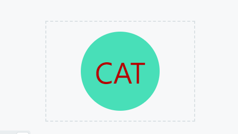
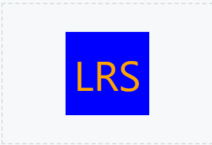

# README Generator

## Table of Contents

- [Description](#description)
- [Installation](#installation)
- [Usage](#usage)
- [Credits](#credits)
- [License](#license)

## Description

This generator is a command line application that generates a SVG logo using user inputs. It also includes a test package using Jest to make sure that proper conditions are in place to create a SVG file.

GitHub repository: https://github.com/LauSmi/SVG-logo-maker

Link to video walk-through: https://drive.google.com/file/d/1k8Fc8Y6E3-gFbUhte84RdLtfZ7_IYLHi/view

Screenshots:

 

 

## Installation

Install jest and inquirer (version 8.2.4) packages for node.js before running this application.

## Usage

To use the generator, open the terminal and run "npm test" to check input conditions. Then, enter the command "node index.js" and follow the prompts. If done correctly, the terminal will display "Generated logo.svg", and a file named "logo.svg" will appear in the explorer with the newly generated logo.

## Credits

University of Minnesota lectures and materials.

For references and tutorials:

https://w3schools.com
https://developer.mozilla.org/en-US
https://github.com/

## License

Licensed under the MIT license.

